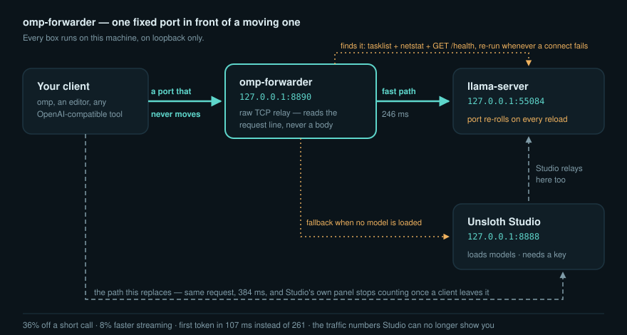
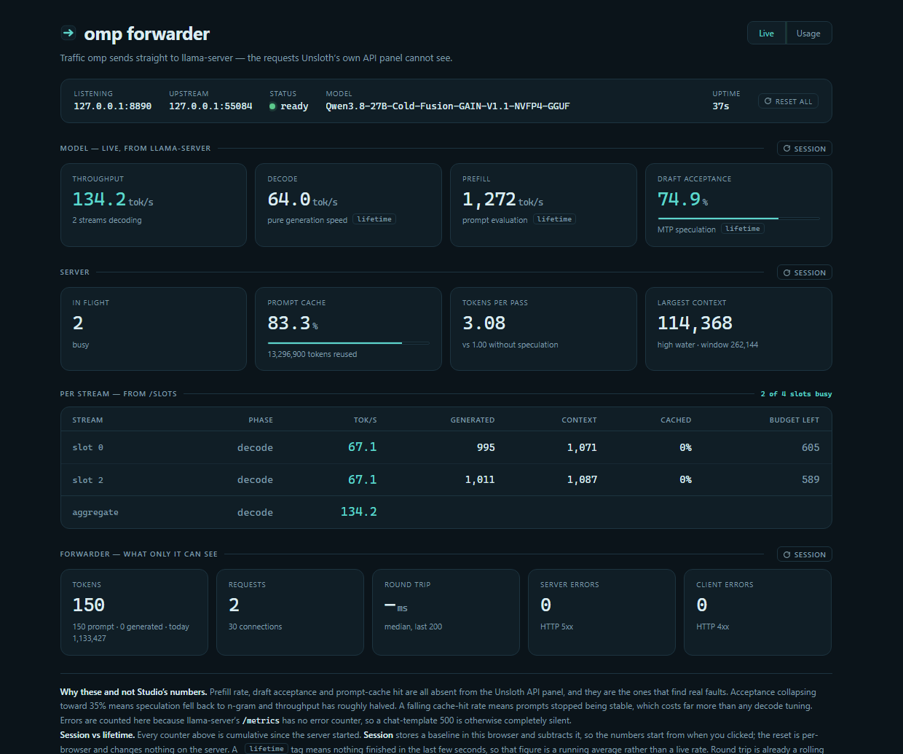
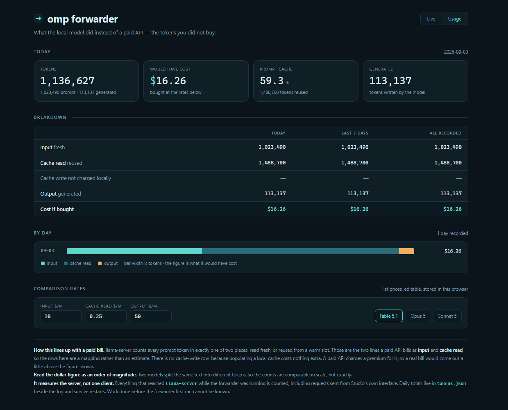
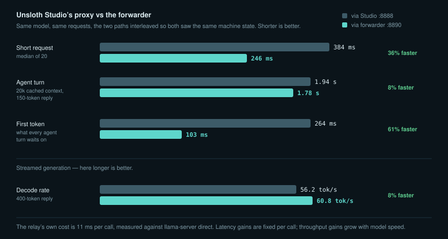

# OMP Forwarder

[](https://github.com/kxl3785/omp-forwarder/actions/workflows/tests.yml)

A fixed local port in front of Unsloth Studio's `llama-server`, so your client
talks to the model directly instead of through Studio's proxy — with a live
dashboard for the traffic Studio can no longer see, and a usage page for what
the local model saved you.

Windows, Python 3.10+, no required dependencies.



## The problem

Unsloth Studio serves an OpenAI-compatible API on `:8888`. That endpoint is a
Python proxy sitting in front of the real `llama-server` process, and it costs
you on every request. Measured on a dual-GPU Windows box, same model, same
prompt, `llama.cpp` with MTP speculative decoding:

| | via Studio `:8888` | direct to `llama-server` |
|---|---|---|
| short request, median of 10 | 0.302 s | **0.136 s** |
| 400-token generation | 109 tok/s | **127 tok/s** |

An agent loop makes many small calls, so the per-call latency and the
per-token cost both compound.

**So why not just point your client at `llama-server`?** Because Studio starts
it on a *random* free port and re-rolls that port on every model reload. On
the box those numbers came from it was 54966, then 60008, then 55084 — in one
morning. No client can hold a direct endpoint.

## What this does

Listens on one port that never changes, finds Studio's current `llama-server`,
and relays raw TCP.

- **Raw TCP, not HTTP.** SSE streaming, keep-alive and chunked bodies pass
  through untouched. It reads only each request's first line, to route it.
- **Lazy re-discovery.** When a connect fails it re-scans, so a model reload
  costs one failed connection instead of a config edit.
- **Waits out a model reload.** A reload leaves a window with no
  `llama-server` at all — measured at 34 seconds on a 27B model. Rather than
  failing the request, the forwarder polls for up to `--wait-for-model`
  seconds (30 by default) and then relays. If the model never appears it
  answers **503 with `Retry-After`**, which tells a client to try again.
- **Loopback only, with no option to change it.** A forwarder that drops an
  API-key requirement should not be reachable off the machine.

Studio stays in charge of loading, unloading and configuring models. The
forwarder is only the wire, plus what it can see on that wire.

## Install

```bash
pipx install git+https://github.com/kxl3785/omp-forwarder
```

Or from a clone:

```bash
pip install -e .
pip install -e ".[tray]"   # adds pywin32, only needed for --tray
```

Or with no install at all:

```bash
PYTHONPATH=src python -m omp_forwarder
```

## Use

```bash
omp-forwarder                      # listen on 8890
omp-forwarder --tray               # ...with a tray icon
omp-forwarder --port 9000
omp-forwarder --exclude-port 8788  # ignore another llama-server you run
omp-forwarder --upstream-port 55084  # skip discovery, pin the port
```

Then point your client at it. For example, in `~/.omp/agent/models.yml`:

```yaml
providers:
  llama.cpp:
    baseUrl: http://127.0.0.1:8890/v1
```

Any API key your client sends is passed through and ignored — `llama-server`
started by Studio has none.

`run_forwarder.bat` starts it with the tray icon and no console window, and
works straight from a clone with no install — it puts `src\` on `PYTHONPATH`
itself. Make a desktop shortcut to that file and point the shortcut's icon at
`assets/omp-forwarder.ico`.

### Options

| flag | meaning |
|---|---|
| `--port N` | port to listen on (default 8890) |
| `--studio-port N` | Studio's API port, used as the fallback (default 8888) |
| `--upstream-port N` | skip discovery and always use this port |
| `--exclude-port N` | never treat this port as the upstream; repeatable |
| `--upstream-exe S` | only use a `llama-server` whose executable path contains `S` |
| `--wait-for-model N` | seconds to wait for a model during a reload (default 30; 0 disables) |
| `--studio-fallback` | relay to Studio when no model is loaded, instead of 503 |
| `--candidate-port N` | a model server discovery cannot find by executable (e.g. a container's published port), probed with `/health` like everything else; repeatable, and the order is the tie-break among healthy candidates |
| `--prefer KIND` | which upstream kind to take when both are healthy: `llama-server` (default) or `candidate`; the preferred kind wins, the other is the fallback when nothing of the preferred kind is up |
| `--tokens-file PATH` | where per-day token totals are kept |
| `--wsl-distro NAME` | WSL distro that hosts the upstream Docker container (use with `--container`) |
| `--container NAME` | Docker container name inside the distro (use with `--wsl-distro`) |
| `--name TEXT` | human label for this forwarder, shown on the dashboard and in the page title |
| `--peer PORT` | another forwarder on this machine; rendered as a status pill in the dashboard header; repeatable |
| `--gpu N` | index of the GPU this lane's model server runs on; marks that card in the dashboard's GPU panel |

## Container-upstream mode

If your `llama-server` runs inside a Docker container inside a WSL distro,
the forwarder can watch that container's state and keep it running:

```bash
omp-forwarder --wsl-distro Ubuntu-24.04 --container sgl
```

Both flags are required together. When given, the forwarder:

- Starts a keepalive process (`wsl -d NAME -u root -- sleep infinity`) that
  prevents WSL2 from tearing the distro down when its last client exits.
- Polls `docker inspect -f {{.State.Status}}` every 10 seconds and stores the
  result. The dashboard shows the container name and its current status in the
  header bar.
- Auto-starts the container (`docker start`) at most once per minute when it
  is in the `exited` state and the relay has no healthy upstream, so a
  container that keeps crashing is not restarted in a tight loop.

The dashboard's **Container** bit in the header bar is hidden when container
mode is off. In `GET /__stats.json` the fields are `container` (status string
or `null`) and `container_name` (the container name, or `null`).

### How the upstream is chosen

Discovery works on two kinds of candidate, probed identically with `/health`
(both `llama-server` and SGLang answer 200 — there is no engine-specific
probe).

- **llama-server** — executable-matched, exactly as before: the PIDs of the
  running `llama-server` processes are taken from `tasklist` and their
  listening ports from `netstat`, then the **highest** healthy one is chosen.
- **candidate** — a port that discovery cannot find by executable: a
  `--candidate-port N` entry, or the container's published port read from
  `docker port` on the 10-second monitor thread (never on the request path).
  When the container exposes one published port, that is the candidate; when
  it publishes several, the first healthy flag-supplied port wins.

An explicit `--upstream-port` always wins over both. Otherwise, among the
healthy candidates, `--prefer` (default `llama-server`) decides which kind to
take: the preferred kind when it is up, the other kind when it is not. Within
a kind, the order is as above (highest port for `llama-server`, first in the
list for `candidate`). If nothing is healthy, the existing `--wait-for-model`
wait-then-503-with-`Retry-After` path applies unchanged. Re-discovery runs
these same rules on every re-scan, so a preferred `llama-server` that comes
back takes over at the next discovery pass without cutting existing
connections.

A model server in a Docker container inside WSL2 (SGLang on `:30000`, say)
has no Windows executable behind its listener, so it is invisible to
executable discovery and must be supplied as a candidate — pass it with
`--candidate-port`, or let the container's published port be derived when
container mode is on.

## Dashboard control surface

When running two forwarders side by side (one per GPU, for example), six
features make the `/__stats` page a truthful control surface rather than a
bag of zeros:

- **Honest status light.** The header bar's status dot reads `ready`,
  `unreachable`, or `no direct server`. It is driven by a 10-second
  background probe of the upstream's `/health` endpoint — not by whether a
  `/metrics` sample succeeded. SGLang has no `/metrics`; the old light read a
  healthy SGLang upstream as red "unreachable". When `/metrics` is not
  provided, every card that depends on it reads "not provided by this
  upstream" instead of "nothing finished yet".

- **Deployment facts panel.** A background sampler thread refreshes engine
  type, thinking mode, speculative algorithm, parallelism, and model path
  every 10 seconds. The engine is detected from whichever endpoint answers:
  SGLang's `/get_server_info` or llama-server's `/props`. The request path
  only copies the cached dict.

- **Container controls.** When container-upstream mode is on, the dashboard
  shows Start / Stop / Restart buttons. They `POST` to a local
  `/__control?token=<T>&action=<action>` endpoint that runs `docker
  start|stop|restart` inside the WSL distro. The token is a fresh 32-hex
  string generated at startup and exposed via `GET /__stats.json`; a foreign
  page cannot read it because the response sends no CORS headers, and a GET
  can never mutate.

- **Lane identity.** `--name` sets a human label shown in the page title and
  header. `--peer` (repeatable) renders a status pill for each peer forwarder:
  a green/red dot, the peer's name (or `:PORT`), and a muted engine +
  thinking suffix. The pill links to that peer's `/__stats` page, so you can
  switch between two side-by-side deployments without losing your place. A
  forwarder never lists itself.

- **GPU panel.** `--gpu N` declares which GPU this lane runs on. The
  dashboard's GPU panel (backed by a 10-second `nvidia-smi` sample) shows one
  row per card: memory used/total in GiB and a utilisation meter. The card
  matching `--gpu` is highlighted with a teal prefix marker. A two-GPU box
  running two forwarders shows both cards in both dashboards, so you can see
  at a glance which lane owns which GPU and how loaded each one is.

- **SGLang support.** When the upstream is SGLang (detected via
  `/get_server_info`), the dashboard's server cards read SGLang's own
  `/metrics` counters instead of `llama-server`'s: `sglang:gen_throughput`
  drives the Throughput card directly (it is a live gauge, not a cumulative
  counter), `sglang:num_running_reqs` + `sglang:num_queue_reqs` drive the
  In-flight card, `sglang:cache_hit_rate` drives the Prompt-cache card as a
  percentage, and `sglang:spec_accept_length` shows as "tau X.X" in the
  Draft-acceptance card. Decode/Prefill split and Per-stream remain "not
  provided by this upstream" — SGLang does not expose per-request slots.
  SGLang's `sglang:prompt_tokens_total` and `sglang:generation_tokens_total`
  are folded into the forwarder's own token tally the same way
  `llama-server`'s are, so the usage page works for both engines.


## The live dashboard

`http://127.0.0.1:8890/__stats` — and `/__stats.json` for the raw sample.



Once your client bypasses `:8888`, Studio's API panel goes blind to it. This
replaces that panel and adds three numbers it never had:

- **Draft acceptance.** With speculative decoding, this is how you learn that
  speculation quietly fell back to n-gram drafting. Acceptance collapsing
  toward 35% roughly halves your throughput, and nothing else reports it.
- **Prefill rate.** Separates "the model is slow" from "your prompts are long".
- **Prompt-cache hit rate.** A falling hit rate means prompts stopped being
  stable, which costs far more than any decode tuning.

Plus **tokens per pass** (the direct payoff of speculation — 1.00 means it is
buying nothing), in-flight and queued requests, largest context seen against
the context window, and the forwarder's own request count, median round trip,
and **HTTP 4xx/5xx counts**. That last one matters: `llama-server`'s
`/metrics` has no error counter, so a 500 from a chat template is otherwise
completely silent.

**Throughput** sums the per-stream decode rates rather than differencing
`tokens_predicted_total`, which only moves when a request *completes* — a
1,932-token reply landing inside one 3-second poll once read as 648 tok/s.
In the screenshot above it reads 134.2 tok/s, matching the per-stream
aggregate of two concurrent requests rather than spiking off a completion.

Every `llama-server` counter is cumulative since the server started, which is
the wrong window when you want to know what just happened. Each section has a
**Session** control that stores a baseline in your browser and subtracts it, so
the figures start from when you clicked. It is a toggle, it is per-browser, and
it changes nothing on the server.

### Per stream

`/metrics` only aggregates, so with several requests in flight it cannot tell
you which one is slow. The per-stream table reads `/slots` instead and gives
each concurrent request its own row: tok/s, tokens generated, context size,
how much of that context came from cache, and how much of its token budget is
left.

It also separates **prefill** from **decode**, which matters more than it
sounds. A slot showing `decoded = 0` is not idle — it is evaluating its prompt,
and on a long one that is most of the request. The table reports its prefill
rate there rather than a misleading "0 tok/s", and marks slots that are merely
`queued` behind other work.

Measured with two requests running side by side: 45.7 and 51.4 tok/s,
aggregate 97.2. Only decode rates are summed — adding a prefill rate to a
decode rate would produce a number that means nothing.

## The usage page

`http://127.0.0.1:8890/__usage` answers a different question: how much work
went to the local model instead of a paid API. Both pages carry the same
**Live / Usage** switch on the title line, over an identical header and page
width, so switching moves nothing on screen but the highlight. The tray menu
opens either one.



It works because `llama-server` counts every prompt token in exactly one of two
places, read fresh or reused from a warm slot. Those are the same two lines a
paid API bills as **input** and **cache read**, so the breakdown is a mapping
rather than an estimate. There is no cache-write row: populating a local cache
costs nothing extra, and a paid API charges a premium for it, so a real bill
would come out slightly above the figure shown.

The page gives today's totals, a breakdown across today, the last seven days
and everything recorded, a per-day history, and what the whole lot would have
cost at rates you can edit. Presets cover a few current models; the rates are
list prices stored in your browser. Read the dollar figure as an order of
magnitude, because two models split the same text into different tokens.

Two things it counts that you might not expect. It measures the **server**, so
requests sent from Studio's own interface land in it too. And it starts when
the forwarder does, so it cannot know about work done before that.

### How the tally survives a model reload

Every `llama-server` counter restarts at zero when Studio reloads a model, so
a total read straight from `/metrics` only ever covers the current process.
The forwarder outlives reloads: it folds successive `/metrics` samples into
one running total, and treats a new port or a counter going backwards as a new
process whose counters are added whole. A reload loses at most the few seconds
since the last sample.

Per-day totals survive restarts too. They live in `tokens.json` beside the log
(`%LOCALAPPDATA%\omp-forwarder\` with `run_forwarder.bat`; `--tokens-file`
overrides), written within 30 seconds of a change and at exit. The log gets one
line per finished day, at the first request of the next day, plus today's
running figure at start and at exit. The tray tooltip and menu carry the same
figure.

## Measuring it yourself

`bench/` holds the scripts behind every number above. Studio's port needs its
API key; give it as `STUDIO_API_KEY`, or point `STUDIO_API_KEY_FILE` at a file
that holds it. The key is read inside the script and never printed.

```bash
python bench/latency.py       # short request, median round trip
python bench/throughput.py    # streamed 400-token generation, decode tok/s
python bench/agent_loop.py    # long cached context + short reply, per turn
python bench/kv_pool.py       # decode speed with the KV pool full vs empty
```

`kv_pool.py` saves and erases every idle slot, then restores them. Run it only
when nothing else is using the server. It leaves its `bench-kv-pool-slot*.bin`
files in llama-server's `--slot-save-path` directory; delete them afterwards.

### What the benchmarks found

Re-measured 2026-09-03 with a 27B reasoning model, the two paths interleaved
so both saw the same machine state:



| workload | via Studio | via forwarder | gain |
|---|---|---|---|
| short request, median of 20 | 384 ms | 246 ms | **36%** |
| agent turn, 20k cached context, 8 turns | 1.94 s | 1.78 s | **8%** |
| agent turn, time to first token | 264 ms | 103 ms | **61%** |
| streamed 400-token reply | 56.2 tok/s | 60.8 tok/s | **8%** |
| the relay's own cost, against `llama-server` direct | — | +11 ms | — |

The latency gain is a fixed cost per call and does not depend on model speed.
The throughput gain is per token, so it grows with a faster model: the 109 vs
127 in the table at the top came from a configuration fast enough for it to
matter, while at 50 tok/s the proxy's per-token cost nearly vanishes into
run-to-run noise. Time to first token is the one an agent user feels on every
turn.

Two findings had nothing to do with the forwarder and cost far more than it
saves. Both are worth knowing if you run long contexts.

**A full unified KV pool halves decode for everyone.** Studio starts
`llama-server` with `--kv-unified`, one KV pool shared by all slots. In that
mode a decode pass attends over the whole occupied pool, not only over its own
tokens. With three idle slots holding about 100,000 tokens of cached agent
context, a short unrelated request ran at 64 tok/s, 25 passes per second. With
those slots saved and erased, the same request ran at 131 to 135 tok/s, 52
passes per second; restoring the slots brought it back down. `bench/kv_pool.py`
reproduces it. The dashboard's **Largest context** card is the early sign: when
it is large and the server is idle, that context is still in the pool.

**On a hybrid model the prompt cache hits only on exact extension.**
Qwen3.5-family GGUFs (`general.architecture = qwen35`) are hybrids: recurrent
SSM layers with full attention every fourth layer. A recurrent state can be
extended but never rolled back, and Studio passes `--ctx-checkpoints 0`, so
there is no saved state to roll back to. The cache is therefore reused only
when a new prompt **extends the slot's exact token sequence**, previous reply
and its reasoning included. Measured on a 15k-token context: an exact
extension prefilled 20 tokens in 43 ms; the same extension with the reasoning
dropped, or the same prompt asked twice, prefilled everything again in about
6,300 ms. Three rules follow for any client — keep `reasoning_content` in the
history you send back, never rewrite earlier turns, and do not retry a
finished turn. Get that wrong and an agent turn takes 30 seconds instead of
one, and no forwarder can help, because prefill dominates. The Studio-side fix
is to turn context checkpoints on, at a memory cost per checkpoint per slot.

## How discovery works

1. List `llama-server` processes (`tasklist`).
2. If `--upstream-exe` is set, keep only those whose executable path contains
   it.
3. Find their listening TCP ports (`netstat -ano`), highest first, skipping
   the forwarder's own port, Studio's port, and anything you excluded.
4. Take the first that answers `GET /health` with 200.
5. Cache it. Re-scan on a failed connect, or from the tray menu.

### If you run more than one `llama-server`

Discovery cannot tell them apart by port, so the wrong model can answer with
nothing in the reply to say so. It happened here: a second `llama-server`
belonging to another project served a 4B model in place of the intended 27B.

`--upstream-exe SUBSTRING` fixes it by keeping only servers whose executable
path contains that substring:

```bash
omp-forwarder --upstream-exe .unsloth
```

The executable path is the right thing to match on because it is the only part
that holds still. Ports change on every model reload, and model names change
whenever you load a different model; an install directory does not. Reading it
costs 0.03 ms for every `llama-server` on the machine, using `ctypes` against
the Windows API rather than another subprocess.

A process whose path cannot be read is excluded, not included: an unknown
executable is not the one you asked for. If nothing matches you get the 503
above, which is the right answer — better than a different model's reply. The
chosen executable appears in `/__stats.json` as `upstream_exe`, and on the
dashboard when you hover the **Upstream** field.

## Development

The tests need nothing installed and no running `llama-server`. They run
against a fake upstream socket, and the discovery tests replace `tasklist` and
`netstat` with recorded output, so they pass on any platform.

```bash
python -m unittest
```

GitHub Actions runs the same command on Ubuntu and Windows, Python 3.10 and
3.13, on every push. The suite covers the relay, discovery, the status
counter, the stats snapshot, and the token tally; it does not cover the tray,
the icon generator, or the two pages' JavaScript.

## Limitations

- **Discovery is Windows-only.** It shells out to `tasklist` and `netstat`.
  The relay itself is portable, so on Linux or macOS pass `--upstream-port`
  and it works fine.
- **The tray needs `pywin32`.** Without it, `--tray` logs a line and runs
  headless.
- **No authentication.** It is loopback-only for that reason. Anything running
  as your user on your machine can reach the model through it — but that was
  already true of `llama-server` itself, which Studio starts with no API key.
- **Two `llama-server` processes look alike by port.** Discovery takes the
  highest-numbered healthy one, so another `llama-server` you run for
  something else can be picked up and answer silently. Use `--upstream-exe`,
  below.
- **`--studio-fallback` needs Studio's API key.** Studio rejects an
  unauthenticated request with 401, which a client reads as a fatal
  configuration error rather than "retry shortly". That is why the fallback is
  off by default and a 503 is returned instead.
- **The 4xx/5xx counter can undercount.** It inspects only reads that begin
  with a status line, rather than tracking HTTP framing, because a relay that
  parsed framing could break streaming. On loopback a status line practically
  never splits across reads. It will not miscount.
- **The usage page measures the server, not one client.** It cannot separate
  your agent's traffic from anything else that reached `llama-server`, because
  telling them apart would mean parsing bodies, and the relay must not.

## The name

Built for [omp](https://github.com/oh-my-pi/oh-my-pi) (Oh My Pi), which is
where the cost showed up first. Nothing in it is omp-specific — it works for
any OpenAI-compatible client pointed at Unsloth Studio.

## The icon

`assets/omp-forwarder.ico` is committed. Regenerate it with:

```bash
python -m omp_forwarder.make_icon
```

Pure standard library, no Pillow. It prints an ASCII preview so you can check
legibility at 16px without opening the file. Two notes if you adapt it: the
frames are uncompressed BMP rather than PNG-in-ICO, because GDI+ renders PNG
frames as per-pixel-alpha noise when the file is loaded in-process; and there
is one drawing at every size, so a 16px tray icon is the same logo as the
256px one.

## License

MIT

## Unloading a GPU from the dashboard

`stop` is the unload. On a container lane it runs `docker stop`, which frees the GPU the container held; on a plain-process lane it terminates the PID the netstat scan attributed to the upstream port. Either way the stop latches: the container monitor will not auto-start what you just unloaded until you press `start` or `restart`, and the bit reads `stopped by operator` while the latch holds.

`start` and `restart` on a process lane need `--upstream-cmd COMMAND`, the command that launches that lane's model server (run on the host exactly as given). Without it the lane can be stopped but not started, and the dashboard shows only `stop`; `/__control` answers 409 to a start. Stopping a server that Unsloth Studio launched frees the GPU but leaves Studio's UI believing it is loaded; unload Studio's own lane from Studio.

## Model presets: put a measured recipe on this lane's GPU

A presets file (`--presets FILE`, default `presets.json` beside the tokens file) names launch recipes. Each is `{"kind": "process"|"container", "port": int or a "{gpu}" template, ...}` with `"cmd"` for a process or `"distro"`, `"container"` (a name template) and `"run"` (a `docker run` line) for a container. Templates take `{gpu}`, `{port}` and `{name}`. A preset never chooses a card: the lane's `--gpu` does, so two lanes give every arrangement -- one recipe on each card, the reverse, or the same on both.

The dashboard's Model row shows one button per preset and `unload`. Assigning unloads whatever the lane fronts, launches the recipe on this GPU, and points the lane at the new port; the existing wait-then-503 covers the load, and the row reads `loading...` until `/health` answers. The assignment is remembered beside the latch, so a restarted forwarder fronts the same server without relaunching it. Over `/__control`: `POST ?token=T&action=assign&preset=NAME`; 409 without `--gpu`, 400 for an unknown name (the reply lists the known ones). Keep the file to recipes you have measured; the seed holds the two that won on 2026-09-05.
